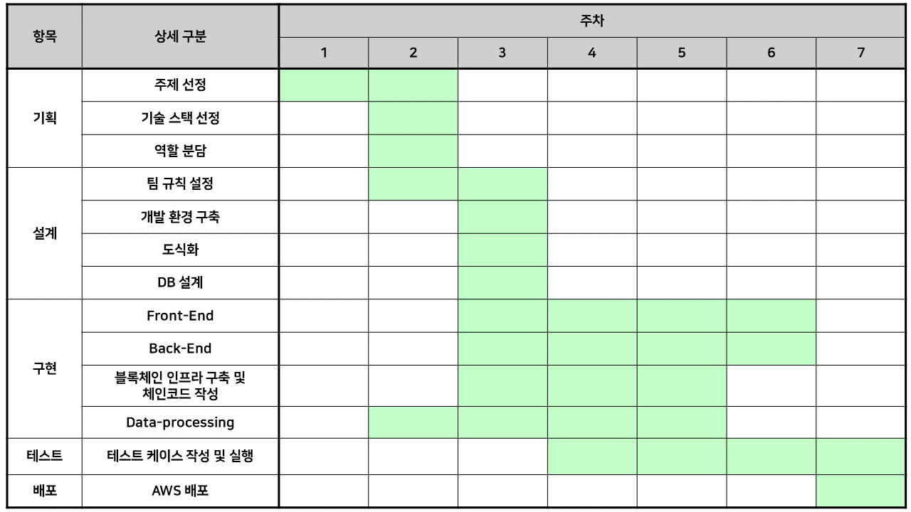

# 진실의 방(Room of Truth)


## Contents

- About RoT
- Team
- Getting Started
- Rule
- Design
- Project Schedule
- Docs

## About RoT


RoT 설명

## Team

팀 소개

## Getting Started

- Front-End
  - Vue.js

- Back-End
  - Spring-Boot

## Rule

- Front-End : Camel Case

- Back-End

  - lowerCamelCase : 지역 변수, private 변수, 메소드
  - UpperCamelCase : 클래스 이름, public 변수, 메소드, 객체 

- Git

  기본적으로 첫 글자는 대문자를 사용하며, 마침표를 제외합니다.

  - FIX : 올바르지 않은 동작을 고친 경우에 사용합니다.

    > Fix A  : A를 수정합니다.

    ```
    Fix login
    ```

  - ADD : 코드나 테스트, 예제, 문서 등의 추가가 있을 때 사용합니다.

    > Add A : A를 추가합니다.

    ```
    Add error pages
    ```

  - REMOVE : 코드의 삭제가 있을 때 사용합니다.

    > Remove A : A를 삭제합니다.

    ```
    Remove unnecessary login code
    Remove sentences from README.md
    ```

  - REFACTOR : 전면 수정이 있을 때 사용합니다.

    > Refactor A : A를 전면 수정합니다.

    ```
    Refactor argument validation
    Refactor login.XML
    ```

  - UPDATE : 개정이나 버전 업데이트가 있을 때 사용합니다. 코드보다는 주로 문서나 리소스, 라이브러리등에 사용합니다.

    > Update A to B : A를 B하기 위해 업데이트 합니다.

    ```
    Update repo docs to use HTTPS
    ```

  - RENAME : 이름 변경이 있을 때 사용합니다.

    > Rename A to B : A를 B로 이름 변경합니다.

    ```
    Rename login_info to loginInfo
    ```

## Design


## Project Schedule



## Docs

[공부 정리](./%5B08%5D%20docs)